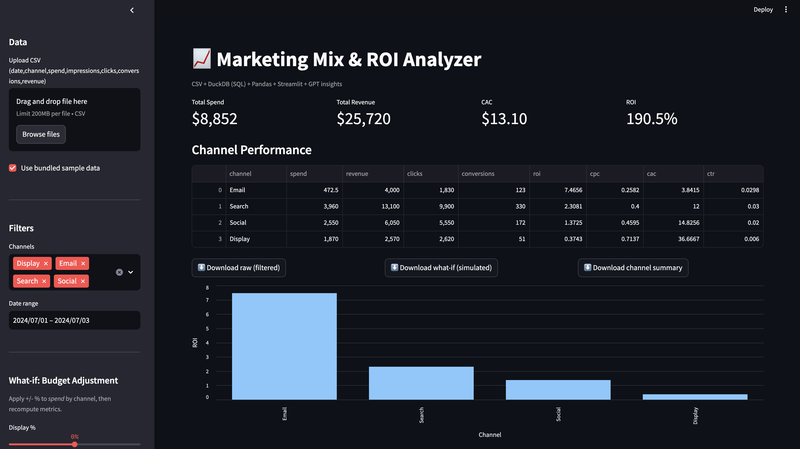
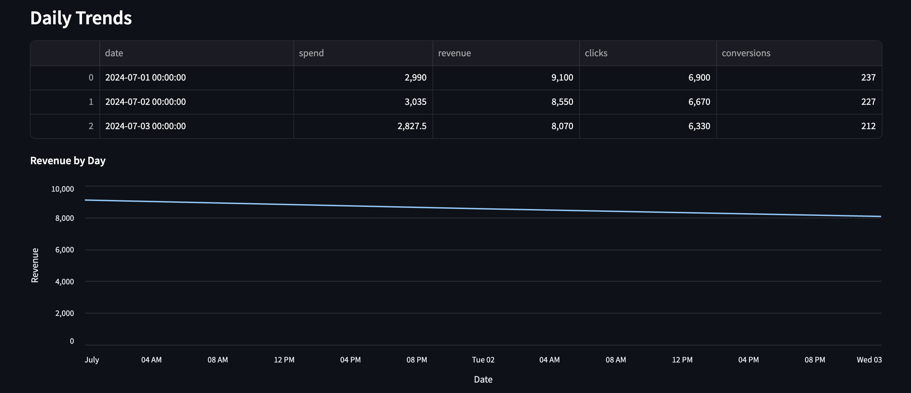
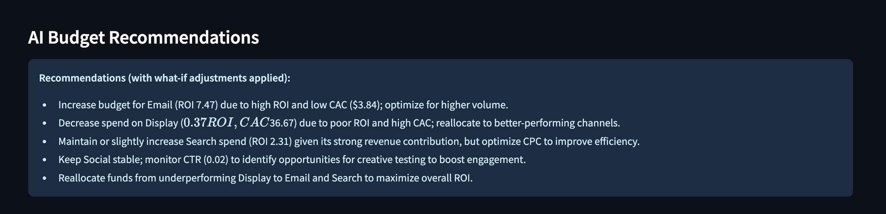

# 📈 Marketing Mix & ROI Analyzer (Streamlit + DuckDB + GPT-4.1)

An AI-powered analytics dashboard that calculates key marketing KPIs (ROI, CAC, CPC, CTR), visualizes trends, simulates budget changes, and generates plain-English recommendations using GPT-4.1.  

This project demonstrates how analytics, SQL, and AI can work together to deliver **business-ready insights** for marketing teams.  

---

## 🚀 Demo (Screenshots)

<p align="center">
  
</p>  

<p align="center">
  
</p>  

<p align="center">
  
</p>  

---

## 🛠️ Tech Stack

- **Frontend/UI:** Streamlit  
- **Database/Queries:** DuckDB (in-process SQL)  
- **Data Analysis:** Pandas  
- **Visualization:** Altair  
- **AI:** OpenAI GPT-4.1 (recommendations)  
- **Secrets management:** `.env` file (with safe `.env.example`)  

---

## ⚡ Quick Start

### 1. Clone the repo  
```bash
git clone https://github.com/<your-username>/roi-analyzer.git
cd roi-analyzer
```
### 2. Create a virtual environment
```bash
python3 -m venv .venv
source .venv/bin/activate
```
### 3. Install dependencies
```bash
pip install -r requirements.txt
```
### 4. Configure environment
Copy the example file and add your own OpenAI API key:
```bash
cp .env.example .env
nano .env
```
.env should look like:
```bash
OPENAI_API_KEY=sk-your-key-here
OPENAI_MODEL=gpt-4.1-nano
```
### 5. Run the app
```bash
streamlit run app.py
```
---

## 📂 Project Structure
```bash
roi-analyzer/
├─ app.py              # Streamlit app (UI + logic + AI)
├─ requirements.txt    # Python dependencies
├─ .env                # Local env vars (ignored by Git)
├─ .env.example        # Example env file (safe to share)
├─ .gitignore          # Ignore secrets, cache, venv
├─ data/
│   └─ marketing_data.csv   # Sample dataset
├─ screenshots/        # Demo images
└─ README.md
```
---

## 📊 Features

- Upload your own CSV dataset or use sample marketing data.

- Compute ROI, CAC, CPC, CTR across channels.

- Visualize daily revenue trends and channel ROI.

- What-if simulation: adjust spend per channel (±50%) and instantly see new KPIs.

- Download raw, simulated, or summary data as CSV.

- GPT-powered AI recommendations for budget reallocation and performance optimization.


